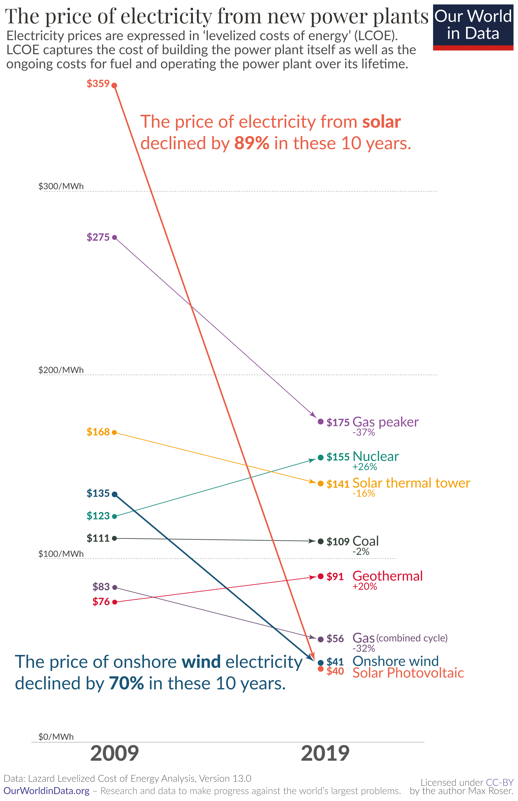

<!-- DATA SOURCES
Emission by sector: https://www.climatewatchdata.org/data-explorer/historical-emissions  
Primary energy: downloaded from https://ourworldindata.org/energy#how-much-energy-does-the-world-consume, data provided by https://www.bp.com/en/global/corporate/energy-economics/statistical-review-of-world-energy.html 
Primary energy by source: downloaded from https://ourworldindata.org/energy#energy-consumption-by-source, data provided by https://www.bp.com/en/global/corporate/energy-economics/statistical-review-of-world-energy.html
sea surface temperature: https://www.epa.gov/climate-indicators/climate-change-indicators-sea-surface-temperature  
global co2 emission: https://www.climatewatchdata.org/data-explorer/historical-emissions  
ambient air pollution deaths: https://apps.who.int/gho/data/view.main.BODAMBIENTAIRDTHS  
natural disasters by type: downloaded from https://ourworldindata.org/natural-disasters, data provided by http://www.emdat.be/  
Sea level rise: https://www.star.nesdis.noaa.gov/socd/lsa/SeaLevelRise/LSA_SLR_timeseries.php  
ice amount: https://climate.nasa.gov/vital-signs/arctic-sea-ice/  
renewable energy investment: downloaded from https://ourworldindata.org/energy#investment-in-renewable-technologies, data provided by http://resourceirena.irena.org/gateway/dashboard/  
electric car sales: https://www.iea.org/data-and-statistics/charts/global-electric-car-sales-by-key-markets-2015-2020  
Co2 mitigation 1.5 and 2 degrees Celcius: https://folk.universitetetioslo.no/roberan/t/global_mitigation_curves.shtml  
Death rates from energy source: https://cambridgehouse.com/news/7971/energy-metals-the-worlds-safest-source-of-energy-will-surprise-you  
Electricity prices: https://appsso.eurostat.ec.europa.eu/nui/submitViewTableAction.do
-->

# Introduction
In this project, pollution is discussed with an emphasis on air pollution and greenhouse gases that contribute towards global warming.
I will look at evidence of climate change, its causes, and its affect on the globe. 
The motivation for this project came when running across this image when surfing the web.

It shows that electricity from solar declined 89% from 2009 to 2019. This sparked an interest in finding out what the worlds primary sources of energy is, and how it has changed over the years.
This interest developed into finding out how the use of nonrenewable energy affects the globe. As the this project will show, the effects can be found on land, in the sea and on people.


```{r setup, include=FALSE}
knitr::opts_chunk$set(echo = TRUE)
library(tidyverse)
library(dplyr)
library(lubridate)
library(zoo)
library(scales)
library(reshape2)
library(ggplot2)
library(gridExtra)
library(maps)
library(rvest)
library(gganimate)
library(RColorBrewer)
```

```{r data, include=FALSE}
emision_by_sector <- read.csv("data/ghg-emissions-by-sector.csv", stringsAsFactors = FALSE)
global_primary_energy <- read.csv("data/global-primary-energy.csv", stringsAsFactors = FALSE)
primary_energy_by_source <- read.csv("data/primary-energy-consumption-by-source.csv", stringsAsFactors = FALSE)
global_temp_anomaly <- read.csv("data/temperature-anomaly.csv", stringsAsFactors = FALSE, skip = 4)
sea_surface_temp <- read.csv("data/sea-surface-temp.csv", stringsAsFactors = FALSE, skip = 6)
global_co_emission <- read.csv("data/annual-co-emissions-by-region.csv")
ambient_air_pollution_deaths <- read.csv("data/ambient-air-pollution-deaths.csv", stringsAsFactors = FALSE, skip = 2)
natural_disasters_by_type <- read.csv("data/natural-disasters-by-type.csv", stringsAsFactors = FALSE)
sea_level_rise <- read.csv("data/sea-level-rise.csv", stringsAsFactors = FALSE, skip = 5)
ice_amount <-read.csv("data/ice-amount.csv", stringsAsFactors = FALSE)
renewable_energy_investment <- read.csv("data/renewable-energy-investment.csv", stringsAsFactors = FALSE)
electric_car_sales <- read.csv("data/global-electric-car-sales-by-key-markets-2010-2020.csv", stringsAsFactors = FALSE, skip = 3)
mitigation_curves_2.0C <- read.csv("data/mitigation_curves_2.0C.csv", stringsAsFactors = FALSE)
mitigation_curves_1.5C <- read.csv("data/mitigation_curves_1.5C.csv", stringsAsFactors = FALSE)
electricity_price_france <- read.csv("data/electricity-price-france.csv", stringsAsFactors = FALSE)
electricity_price_germany <- read.csv("data/electricity-price-germany.csv", stringsAsFactors = FALSE)
```

```{r include=FALSE}
emision_summarized <- emision_by_sector %>%
  group_by(Year) %>%
  summarise_at(vars(Agriculture..GHG.Emissions..CAIT.:Transport..GHG.Emissions..CAIT.), sum, na.rm=TRUE)

df_emission_by_sector <- melt(emision_summarized, id.vars = c("Year")) %>%
  mutate(variable =
           recode(variable,
                  "Agriculture..GHG.Emissions..CAIT."="Agriculture",
                  "Bunker.Fuels..GHG.Emissions..CAIT."="Shipping",
                  "Industry..GHG.Emissions..CAIT."="Industry",
                  "Land.Use.Change.and.Forestry..GHG.Emissions..CAIT."="Land-Use Change and Forestry",
                  "Waste..GHG.Emissions..CAIT."="Waste",
                  "Buildings..GHG.Emissions..CAIT."="Buildings",
                  "Electricity...Heat..GHG.Emissions..CAIT."="Electricity and Heat",
                  "Fugitive.from.energy.production..GHG.Emissions..CAIT."="Fugitive",
                  "Manufacturing.Construction.energy..GHG.Emissions..CAIT."="Manufacturing and Construction",
                  "Other.Fuel.Combustion..GHG.Emissions..CAIT."="Other fuel combustion",
                  "Transport..GHG.Emissions..CAIT."="Transport"))

total_emission_2016 <- df_emission_by_sector %>%
  filter(Year==2016) %>%
  summarize(Totlal_Emission=sum(value, na.rm = TRUE))

total_electricity_2016 <- df_emission_by_sector %>%
  filter(Year==2016 & variable=="Electricity and Heat") %>%
  summarize(Total_Electricity=sum(value, na.rm = TRUE))
```

```{r globalEnergySources}
df_global_primary_energy <- melt(global_primary_energy, id.vars = "Year") %>% # Melt data frame such that all sources are in one column.
  filter(Year >= 1965) %>%
  mutate(variable =
           recode(variable,
                  "Coal..TWh..direct.energy."="Coal",
                  "Oil..TWh..direct.energy."="Oil",
                  "Gas..TWh..direct.energy." = "Gas",
                  "Hydropower..TWh..direct.energy."="Hydropower",
                  "Nuclear..TWh..direct.energy."="Nuclear",
                  "Solar..TWh..direct.energy."="Solar",
                  "Other.renewables..TWh..direct.energy."="Other renewables",
                  "Traditional.biomass..TWh..direct.energy."="Biomass",
                  "Wind..TWh..direct.energy."="Wind",
                  "Biofuels..TWh..direct.energy." = "Biofuels")
         )

# Extract the nonrenewable sources.
df_global_primary_nonrenew <- df_global_primary_energy %>%
  filter(variable == c("Coal", "Oil", "Gas"))

# Extract renewable sources.
df_global_primary_renew <- df_global_primary_energy %>%
  filter(variable == c("Hydropower", "Solar", "nuclear"," Other renewables", "Wind", "Nuclear"))
```

```{r renewableEnergyInvestment, include=FALSE}
df_renewable_investment <- renewable_energy_investment %>%
  group_by(Entity) %>%
  rename("Investment"="Investment.in.Renewables.by.Region..IRENA..2016..")
```

```{r globalTempAnomaly, include=FALSE}
df_global_temp_anomaly <- global_temp_anomaly %>%
  mutate(Value = replace(Value, Value == -999, NA)) # NA values are represented as -999 in original dataset. 
```

```{r seaLeveLTemp, include=FALSE}
sea_surface_temp
df_sea_surface_temp <- sea_surface_temp %>%
  select(Year, Annual.anomaly)
```

```{r gloablCoEmission, include=FALSE}
df_global_co_emission <- global_co_emission %>%
  filter(Entity=="World" & Year >= 1880) %>%
  group_by(Year) %>%
  summarize(Sum_Year=sum(Annual.CO2.emissions))
```

```{r ambientAirPollutionDeaths, include=FALSE}
# Variables are represented in the form: median [range].
pollution_deaths_2016 <- ambient_air_pollution_deaths %>%
  filter(Cause=="Total") %>%
  mutate(Both.sexes=as.numeric(gsub("([0-9]+) .*", "\\1", Both.sexes))) %>% # Only want median value.
  summarise(Sum_Deaths=sum(Both.sexes, na.rm = TRUE))
```

```{r naturalDisaters, include=FALSE}
df_natural_disasters <- natural_disasters_by_type %>%
  filter(Entity==c("Wildfire", "Drought", "Extreme temperature", "Flood")) %>%
  rename("Num_Disasters"=Number.of.disasters..EMDAT..2020..)
```

```{r globalSeaLevel, include=FALSE}
df_sea_level_rise_global <- melt(sea_level_rise, id.vars = "year") %>%
  drop_na() %>%
  mutate(Ocean="Global")
df_sea_level_rise_global
```

```{r regionalSeaLevelScrape, eval=FALSE, include=FALSE}
# Scrape sea level data. 
# This chuck will download sea data from https://www.star.nesdis.noaa.gov/socd/lsa/SeaLevelRise/LSA_SLR_timeseries.php,
# and is set to not run. The data up until December 2020 is already found in the 'regional sea level' folder.
# If more recent data is wanted, set eval to true.
sea_level_URL <- "https://www.star.nesdis.noaa.gov/socd/lsa/SeaLevelRise/LSA_SLR_timeseries.php"
sea_URL_short <- "https://www.star.nesdis.noaa.gov/socd/lsa/SeaLevelRise/"
webpage <- read_html(sea_level_URL)

desired_oceans <- c("Pacific Ocean", "Atlantic Ocean", "Indian Ocean")

i <- 0
#Scrape csv file names and download them.
for (i in 4:27) {
  ocean_name_node <- sprintf("#list2 tr:nth-child(%s) th", i)
  ocean_name <- webpage %>% html_nodes(ocean_name_node) %>% html_text()
  if (ocean_name %in% desired_oceans) {
    ocean_name_nospace <- gsub(" ", "-", ocean_name)
    file_node<- sprintf("#list2 tr:nth-child(%s) th+ td a:nth-child(1)", i)
    file_name <- webpage %>% html_nodes(file_node) %>% html_attr("href")
    file_URL <- paste(sea_URL_short, file_name, sep="")
    dest <- paste("data/regional-sea-level/", ocean_name_nospace, ".csv", sep="")
    download.file(url=file_URL, destfile = dest)
  }
}
```

```{r wrangleRegionalSeaLevelData, include=FALSE}
# Get average change in selected oceans.
get_ocean_data <- function(oceans) {
  df_sea_level_rise_regional <- NULL
  for (ocean in oceans) {
    file_path <- paste("data/regional-sea-level/", ocean, ".csv", sep="")
    file <- read.csv(file_path, stringsAsFactors = FALSE, skip = 5)
    average_sea_level_change <- melt(file, id.vars = "year")
    if (is.null(df_sea_level_rise_regional)) {
      df_sea_level_rise_regional <- data.frame(Ocean=ocean, Average_change=average_sea_level_change)
    } else {
      df_temp <- data.frame(Ocean=ocean, Average_change=average_sea_level_change)
      df_sea_level_rise_regional <-  rbind(df_sea_level_rise_regional, df_temp)
    }
  }
  df_sea_level_rise_regional <- df_sea_level_rise_regional %>%
    rename("year"=Average_change.year, "variable"=Average_change.variable, "value"=Average_change.value)
  
  return(df_sea_level_rise_regional)
}
```

```{r reguonalSeaDataClean, include=FALSE}
oceans <- c("Pacific-Ocean", "Atlantic-Ocean", "Indian-Ocean")

df_sea_level_by_ocean <- get_ocean_data(oceans)
```

```{r arcticSeaIce, include=FALSE}
df_arctic_sea_ice <- ice_amount %>%
  select(c(year, extent))

mean_ice_melt <- df_arctic_sea_ice %>%
  summarise(avg_change = mean(c(NA, diff(extent)), na.rm = TRUE))
```

```{r electricCarSales, include=FALSE}
electric_car_sales
electric_car_sales <- electric_car_sales %>%
  select(c("X", "Market.Share"))

df_electric_car_sales <- melt(electric_car_sales, id.vars = "X") %>%
  rename("Year"="X") %>%
  filter(Year < 2020) %>%
  group_by(Year) %>%
  summarize(Sum_Market_Share=sum(value, na.rm=TRUE))

df_electric_car_sales
```

```{r mitigationCurves, include=FALSE}
df_mitigation_curves_2.0C_hist <- melt(mitigation_curves_2.0C, id.vars = "Year") %>%
  filter(Year >= 1980, variable == "Historical")

df_mitigation_curves_2.0C_exclud <- melt(mitigation_curves_2.0C, id.vars = "Year") %>%
  filter(Year >= 1980, variable != "Historical")

df_mitigation_curves_1.5C_hist <- melt(mitigation_curves_1.5C, id.vars = "Year") %>%
  filter(Year >= 1980, variable == "Historical")

df_mitigation_curves_1.5C_exclud <- melt(mitigation_curves_1.5C, id.vars = "Year") %>%
  filter(Year >= 1980, variable != "Historical")
```

```{r deathsBySorce, include=FALSE}
# Scrape table from website.
URL <- "https://cambridgehouse.com/news/7971/energy-metals-the-worlds-safest-source-of-energy-will-surprise-you"
webpage <- read_html(URL)
result <- NULL
i <- 0

for (i in 1:7) {
  source_node <- sprintf("tr:nth-child(%s) td:nth-child(1)", i)
  source_name <- webpage %>% html_nodes(source_node) %>% html_text() # Energy source value
  death_node <- sprintf("tr:nth-child(%s) td:nth-child(2)", i)
  death_num <- webpage %>% html_nodes(death_node) %>% html_text() # Deaths by source
  result <- rbind(result, c(source_name, death_num))
}

df_deaths_by_source <- as.data.frame(result, stringsAsFactors = FALSE) %>% 
  rename("Source" = V1, "Deaths_Per_1000_TWh" = V2) %>%
  mutate(Deaths_Per_1000_TWh = as.numeric(gsub(",", "", Deaths_Per_1000_TWh)))
df_deaths_by_source
```

```{r}
electricity_price_france
df_electricity_price_france <- electricity_price_france %>%
  select(TIME, Value)

df_electricity_price_germany <- electricity_price_germany %>%
  select(TIME, Value)
```

```{r}
primary_energy_by_source

renewable_consumption_by_country <- function(country) {
  df_primary_energy_by_source <- primary_energy_by_source %>%
  filter(Year >= 1980 & Entity == country) %>%
  select(!c(Entity, Code))


  df_primary_energy_by_source <- melt(df_primary_energy_by_source, id.vars = "Year") %>%
    mutate(variable =
             recode(variable,
                    "Hydro.Generation...TWh" = "Hydro",
                    "Nuclear.Generation...TWh" = "Nuclear",
                    "Solar.Generation...TWh" = "Solar",
                    "Wind.Generation..TWh" = "Wind")) %>%
    filter(variable == c("Hydro", "Nuclear", "Solar", "Wind"))
  
  return(df_primary_energy_by_source)
}

df_primary_energy_by_source_GR <- renewable_consumption_by_country("Germany")
df_primary_energy_by_source_FR <- renewable_consumption_by_country("France")
```

```{r}
ggplot(df_primary_energy_by_source_GR, aes(x=Year, y=value, colour=variable)) +
  geom_line()
```
```{r}
ggplot(df_primary_energy_by_source_FR, aes(x=Year, y=value, colour=variable)) +
  geom_line()
```


```{r plotAstetics, include=FALSE}
pltTheme <- theme_light() + theme(plot.title = element_text(hjust = 0.5))
```


<!-- The bad -->
# Emission causes and effects

This plot shows how many million tonnes of greenhouse gasses that were released from 1990-2016, measured in the equivalent amount of carbon dioxide that would produce that same amount of energy.

```{r echo=FALSE, fig.width=10, fig.align="center"}
ggplot(df_emission_by_sector, aes(Year, value, col=variable)) + 
  labs(y="Million tonnes", title="Emission by sector in million tonnes carbon dioxide-equivalents", colour="Sector") +
  pltTheme +
  geom_line()
```

Electricity an heat seems to be a big contributor to greenhouse gases. Of the `r format(round(total_emission_2016), big.mark=",",scientific=FALSE)` tonnes of greenhouse gases, electricity and heat makes out to be `r format(round((total_electricity_2016/total_emission_2016)*100))`% of the total emission.

Transport, buildings, industries, electricity and heat all need a source of energy. 
Let's look at the primary sources of energy the world consumes.

```{r echo=FALSE, fig.width=14, fig.align="center"}
ggplot(df_global_primary_energy, aes(Year, value, col=variable)) + 
  labs(y="TWh", title="Global primary energy sources.", colour="Source") +
  pltTheme +
  geom_line()
```

As expected, coal, oil and gas are the worlds primary energy sources. The next visualization tries to emphasize in a higher degree.


```{r echo=FALSE, fig.align="center"}
ggplot(df_global_primary_energy, aes(Year, value, fill=variable)) + 
  labs(y="TWh", title="Global primary energy sources.", colour="Source") +
  pltTheme +
  geom_area(position = "stack") 
```

The use of nonrenewable energy, and the greenhouse gases it emits, correlates to rising temperatures across the world. 
Under is a visualization of rising temperatures in both land and sea surface, and the amount of carbon dioxide emitted from fossil fuels. 

```{r echo=FALSE, fig.width=14, fig.width=10, fig.height=10, fig.align="center"}
plt_emission <- ggplot(df_global_co_emission, aes(x=Year, y=Sum_Year)) +
  geom_line(color="red") +
  labs(y="Co2 emission in milion tonnes") +
  pltTheme

plt_temperature_land <- ggplot(df_global_temp_anomaly, aes(x=Year, y=Value)) +
  geom_line(color="blue") +
  labs(y="Temperature land") +
  pltTheme

plt_temperature_sea <- ggplot(df_sea_surface_temp, aes(x=Year, y=Annual.anomaly)) +
  geom_line(color="green") +
  labs(y="Temperature sea surface") +
  pltTheme

grid.arrange(plt_emission, plt_temperature_land, plt_temperature_sea, nrow=3)
```
There is a `r format(round(cor(df_global_co_emission$Sum_Year, df_global_temp_anomaly$Value[0:139]), 2), nsmall=2)` correlation between the rising land temperatures and carbon dioxide emissions. 

Furthermore, ambient air pollution which is pollution from motor vehicles, oil and coal power plants, oil refineries etc. has resulted in `r format(pollution_deaths_2016,big.mark=",",scientific=FALSE)` deaths across the globe in 2016$^{[1][2]}$. Research has also suggested that greenhouse gases has increased the  frequency of natural disasters like hurricanes, floods, storms, droughts and wildfires$^{[3]}$.

```{r echo=FALSE, fig.width=10, fig.align="center"}
ggplot(df_natural_disasters, aes(x=Year, y=Num_Disasters, fill=Entity)) +
  labs(y="Value", title="Number of natural disasters.") +
  geom_col() +
  pltTheme +
  theme(legend.position = "none") +
  facet_wrap(~Entity, scales = "free_y")
```
https://ourworldindata.org/natural-disasters

Floods could be linked to rising sea levels which again is caused by melting ice in the arctics.
This plot shows the rate at which ice is depleting from the arctic.

```{r echo=FALSE, fig.align="center"}
ggplot(df_arctic_sea_ice, aes(x=year, y=extent)) +
  labs(y="Million square km.") +
  pltTheme +
  geom_line()
```
https://climate.nasa.gov/vital-signs/arctic-sea-ice/ 

Here is a plot of changing water levels globally, and  for some of the larger oceans in the world. The change is expressed in millimeters and the sea level is thought to be rising by an average of three millimeters a year. 

```{r echo=FALSE, fig.width=14, fig.align="center", message=FALSE, warning=FALSE}
ggplot(data=df_sea_level_by_ocean, aes(x=year, y=value, color=variable)) +
  geom_line(data=df_sea_level_rise_global) +
  geom_line() +
  geom_smooth() +
  labs(y="Millimeters", title="Change is sea level.", colour="Altimeter") +
  scale_x_continuous(breaks = seq(1992, 2020, by=5)) +
  pltTheme +
  facet_wrap(~Ocean)
```
Altimetry data are provided by the NOAA Laboratory for Satellite Altimetry.

<!-- The good -->

The world is taking steps towards reducing our carbon footprint. The Paris agreement is an effort to reduce global greenhouse emissions and has set a goal that the global temperature will not exceed 2 degrees Celsius by the year 2100 or at best case 1.5 degrees Celsius.
This primarily means that the use of fossil fuels has to decline and be replaced by renewable sources. 

# Preventing increased pollution
Dividing the renewable sources from the nonrenewable sources in the previous energy sources plot, it can bee seen that renewable energy has been on a heavy rise since around 2005. 

```{r plotNonVsRenew, echo=FALSE, fig.width=14, fig.align="center"}
plt_renew <- ggplot(df_global_primary_renew, aes(Year, value, col=variable)) + 
  labs(y="TWh", title="comsumption of renewable energy.", colour="Renewable sources") + 
  pltTheme +
  geom_line()

plt_nonrenew <- ggplot(df_global_primary_nonrenew, aes(Year, value, col=variable)) +
  labs(y="TWh", title="Consumption of nonrenewable energy.", color="Nonrenewable sources") +
  pltTheme +
  geom_line()

grid.arrange(plt_renew, plt_nonrenew, ncol=2)
```

Here, nuclear energy has been chosen to be added to the renewable sources. This is because research shows it is far safer than any nonrenewable sources and is close to being as safe as any of the other renewable sources on this graph.
As the next chart shows, deaths because of nuclear energy is surprisingly low.

```{r, echo=FALSE, fig.width=8, fig.align="center"}
ggplot(df_deaths_by_source, aes(x = Source, y = Deaths_Per_1000_TWh, fill = Source)) + 
  labs(y="Deaths", x="Energy source", title="Deaths per 1,000 TWh by energy source")+
  pltTheme +
  theme(legend.position = 0) +
  geom_col()
```

additionally, the CO2 emissions from nuclear energy is very low, even lower than energy for wind and from photovoltaic sources

The rise in renewable energy sources is partly an effect of greater investment in renewable energy sources$^{[5]}$.

```{r echo=FALSE, fig.width=14, fig.align="center"}
ggplot(df_renewable_investment, aes(x=Year, y=Investment, colour=Entity)) + 
  labs(y="Investment in billion USD.") +
  pltTheme +
  geom_line()
```

Returning to emissions by sector, it can be seen that transport is the next highest source of carbon dioxide-equivalent emission. Progress has been made towards shifting to electric, as the sales of electric cars rise every year. Due to environmental reasons, driving an electric car has been given a lot of benefits. In Norway the price of charging an electric car versus using fossil fuel favors the electric car heavily when it comes to cost. Also, taxes and insurance comes cheaper with an electric car.

```{r echo=FALSE, fig.width=10, fig.align="center"}
ggplot(df_electric_car_sales, aes(x=Year, y=Sum_Market_Share/100)) +
  pltTheme +
  scale_y_continuous(labels=percent) +
  scale_x_continuous(breaks=seq(2010, 2019, 1)) +
  labs(y="Market share", title="Electric car market share.") +
  geom_col()
```
IEA, Global electric car sales by key markets, 2010-2020, IEA, Paris https://www.iea.org/data-and-statistics/charts/global-electric-car-sales-by-key-markets-2015-2020

# Conclusions
Decreasing co2 emissions to stay clear of an 2.0 degree Celsius global temperature increase is no small feat, and for 1.5 degrees Celsius, nearly impossible.
Here it is shown how much co2 emission the world has to drop to stay clear of these temperature increases by what year year we start in.

```{r echo=FALSE, fig.width=14, fig.height=15, fig.align="center", message=FALSE, warning=FALSE}
ncols = 30
colors <- colorRampPalette(brewer.pal(8, "BuPu"))(ncols)
plt_2.0C <- ggplot(df_mitigation_curves_2.0C_exclud, aes(x=Year, y=value, color=variable)) +
  geom_line(data=df_mitigation_curves_2.0C_hist,color="black") +
  pltTheme +
  theme(legend.position = 0) +
  scale_color_manual(values=colors) +
  labs(y="Billion tonnes", title="CO2 reduction needed to stay under 2,0°C") +
  geom_line()

plt_1.5C <- ggplot(df_mitigation_curves_1.5C_exclud, aes(x=Year, y=value, color=variable)) +
  geom_line(data=df_mitigation_curves_2.0C_hist,color="black") +
  pltTheme +
  theme(legend.position = 0) +
  scale_color_manual(values=colors) +
  labs(y="Billion tonnes", title="CO2 reduction needed to stay under 1,5°C") +
  geom_line()

grid.arrange(plt_2.0C, plt_1.5C, nrow=2)
```

Analysis has estimated that with no climate policies implemented, the global temperature would rise to 4.1°C in 2100$^{[4]}$.
Luckily the world is taking action and with current policies the temperature anomaly will hopefully stay under 3°C. 

Sources:
Global temperature anomaly
https://www.ncdc.noaa.gov/cag/global/time-series/globe/land_ocean/ytd/12/1880-2019  
[1].https://www.who.int/airpollution/ambient/pollutants/en/ WHO Ambient air pollution  
[2].https://apps.who.int/gho/data/node.main.BODAMBIENTAIRDTHS?lang=en WHO Deaths caused by ambient air pollution  
[3].Anderson, Jason, and Camilla Bausch. "Climate Change and Natural Disasters: Scientific evidence of a possible relation between recent natural disasters and climate change." Policy Department Economic and Scientific Policy 2 (2006).     
[4].https://climateactiontracker.org/global/temperatures/  
[5].https://www.giss.nasa.gov/meetings/pollution2002/summaryd.html  