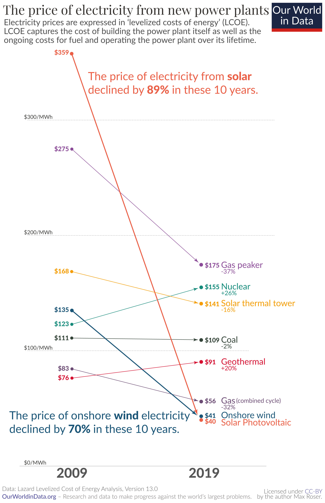

# Overview and Motivation
Greenhouse gas emissions has changed the world, temperatures are rising and natural disasters happen more frequently. In this project, a study is performed on how humans contribute to global warming, how this affects the world, what we can do and what our future looks like.

# Related Work
What initially motivated this project was a graph of the massive price decline in solar energy from the last ten years. This created a ripple effect which led to studying pollution from the worlds energy sources. Related work can be found at https://climate.nasa.gov/resources/global-warming-vs-climate-change/.

# Initial Questions
How our primary energy share by source has changed over the years led to the question of pollution. This led to further questions on how pollution changes the world, what we can do about it and what our future looks like.

# Data
Data has been collected from many different sources, primarily through downloadable csv and xlsx files, but also through web scraping when this was not accessible. All sources with links can be found at the top of the markdown and HTML files. 

# Exploratory Analysis
In this project, an attempt has been made to select the method of visualization that best fits the data in question. Using a stacked graph to better show majorities, a pie chart to show the share of variables, and overlapping continuous graphs and bar graphs to show differences between variables. Visualization could be improved by including heat maps with animation for both land and ocean.

# Final Analysis
From this project it has been learned that the effects of greenhouse gas emissions can be found in many places. Since the industrial revolution, natural disasters happen more and more frequently and nuclear energy might be the worlds best option when it comes to reducing emissions. The findings in this project are supported by using data from reliable sources.
